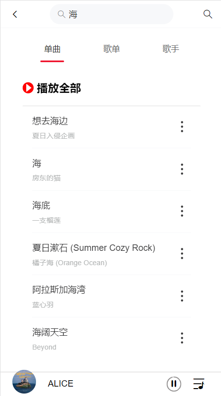

## 安装

```
npm install
```

### 运行

```
npm run serve
```

### 打包

```
npm run build
```

### 技术栈

vue + vant

### 后端接口

使用[NeteaseCloudMusicApi](https://github.com/Binaryify/NeteaseCloudMusicApi.git)调取网易云官方 api

### 项目效果预览

|        |  |      |
| ----------------------------------------------- | ----------------------------------------------- | --------------------------------------------------- |
|  |      |  |
